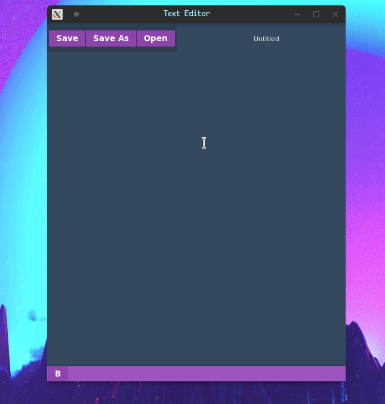

# Text Editor

simple text editor with Nice **Theme** build with  using .
this project is just simple text editor that can do almost basic things like **open file**
or **save file** and **edit those files** and any basic thing for simple text editor.

###**project state**:

## Demo:

## TO-DO:

- [ ] Add number for lines.
- [ ] Saved or not Saved indicator.
- [ ] Add some useful info in the bottom frame.
- [ ] Add settings page to control of the font size for example.